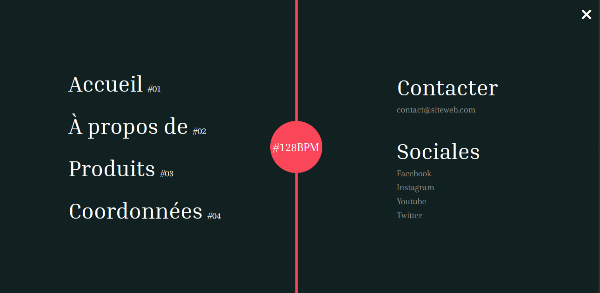

 # Un menu responsive animé avec HTML, CSS, JAVASCRIPT et GSAP ! 
 

	

---------------------------------------------------------------------------------------------------------------

	image: https://unsplash.com/photos/SLUeuL-mrRg

	Photo by <a href="https://unsplash.com/@arstyy?utm_source=unsplash&utm_medium=referral&utm_content=
	creditCopyText">Austin Neill</a> on <a href="https://unsplash.com/?utm_source=unsplash&utm_medium=
	referral&utm_content=creditCopyText">Unsplash</a>
  

	https://cdnjs.com/libraries/font-awesome

	<link rel="stylesheet" href="https://cdnjs.cloudflare.com/ajax/libs/font-awesome/6.1.1/css/all.min.css"
	 integrity="sha512-KfkfwYDsLkIlwQp6LFnl8zNdLGxu9YAA1QvwINks4PhcElQSvqcyVLLD9aMhXd13uQjoXtEKNosOWaZqXgel0g=
	=" crossorigin="anonymous" referrerpolicy="no-referrer" />

	https://fontawesome.com/v5/icons/bars?s=solid

	https://cdnjs.com/libraries/gsap/3.7.0

	google font

	<link rel="preconnect" href="https://fonts.googleapis.com">
	<link rel="preconnect" href="https://fonts.gstatic.com" crossorigin>
	<link href="https://fonts.googleapis.com/css2?family=Arapey&family=Inria+Serif&display=swap" rel="stylesheet">

	CSS rules to specify families

	font-family: 'Arapey', serif;
	font-family: 'Inria Serif', serif;
